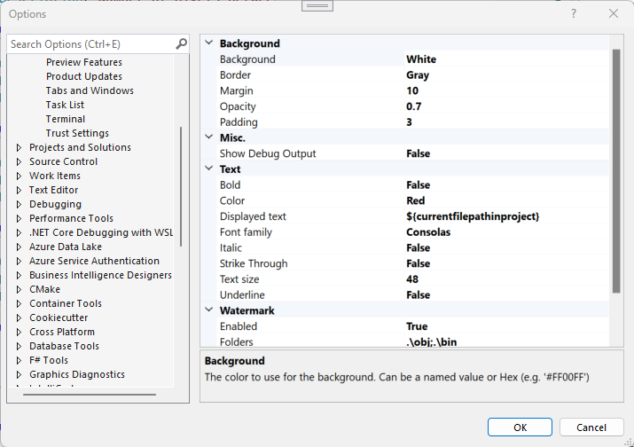

# SubfolderWatermarks

## Table of Contents
1. [What is SubfolderWatermarks](#What-is-SubfolderWatermarks)
2. [Configuration](#Configuration)
3. [Installation](#Installation)
5. [Acknowledgements](#Acknowledgements)
4. [License](#License)

## What is SubfolderWatermarks
SubfolderWatermarks displays a text watermark over the Visual Studio editor for files in specific project subfolders.
For example, you can mark auto-generated files with watermarks so that you do not accidentally edit them by mistake.

The highlighted text may appear as part of the text in the editor but is floating above it. It stays put when you scroll.

## Configuration

Size, position, color, and text are fully configurable.

Go to **Tools** &gt; **Options** and select **Watermarks**

### Use placeholders

Show something different for each file with placeholders.
This can help you (or anyone looking at the screen) differentiate files more easily.

Simply enter one of the following in the configured `Displayed text` and it will be replaced when shown in the editor.

- **`${currentFilePathInProject}`** - is replaced with the relative path of the file in the project (within the solution). This is the default.
- **`${currentFileName}`** - is replaced with the name of the current file.
- **`${currentDirectoryName}`** - is replaced with the name of the directory (on disk) that contains the current file.
- **`${currentProjectName}`** - is replaced with the name of the project (within the solution) the file is in.

If any of the placeholders can't be resolved, they're replaced with an empty string.  
You can use multiple placeholders at once and combine them with other text.  
Placeholders are not case-sensitive.

### Display Images

Display an image rather than text.

To do this, set the `DisplayedText` to start with **`IMG:`** immediately followed by an absolute path to the file to use.

## Installation
You can install SubfolderWatermarks by going to the "Extensions" menu on the Visual Studio menu bar: 

You may also download SubfolderWatermarks from [Visual Studio Marketplace](https://marketplace.visualstudio.com/items?itemName=ProgramountInc.SubfolderWatermarks).

## Acknowledgements
I would like to express my gratitude to Mr. Matthew Lacey for his inspiring VSWaterMark project, which is the basis of this open source project.
Because adding watermark by project subfolders did not fit into Mr. Lacey's plans for VSWaterMark, I created SubfolderWatermarks as a spin-off from VSWaterMark, and SubfolderWatermarks is now developed independently. 

 I greatly appreciate his dedication to creating valuable open source tools and encourage everyone to explore VSWaterMark at https://github.com/mrlacey/VSWaterMark/.

## License
SubfolderWatermarks is under the <a href="https://opensource.org/license/mit/">MIT License</a>.
